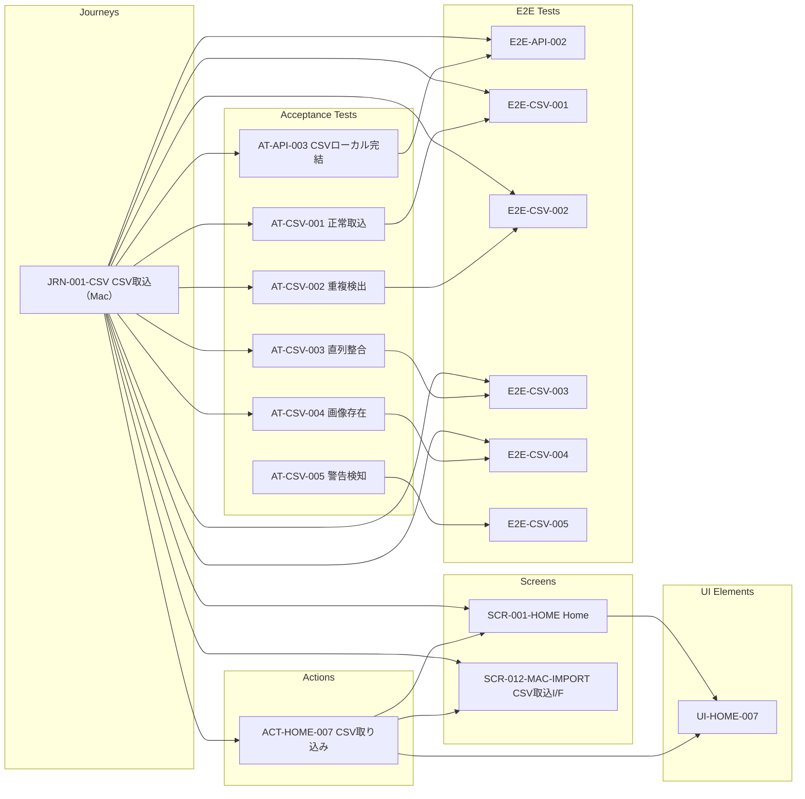

# SCR-012-MAC-IMPORT マップ

```mermaid
flowchart LR
  %% SCR-012-MAC-IMPORT
  subgraph JRN["Journeys"]
    N14["JRN-001-CSV CSV取込（Mac）"]
  end
  subgraph ACT["Actions"]
    N1["ACT-HOME-007 CSV取り込み"]
  end
  subgraph SCR["Screens"]
    N15["SCR-001-HOME Home"]
    N16["SCR-012-MAC-IMPORT CSV取込I/F"]
  end
  subgraph UI["UI Elements"]
    N17["UI-HOME-007"]
  end
  subgraph AT["Acceptance Tests"]
    N2["AT-API-003 CSVローカル完結"]
    N3["AT-CSV-001 正常取込"]
    N4["AT-CSV-002 重複検出"]
    N5["AT-CSV-003 直列整合"]
    N6["AT-CSV-004 画像存在"]
    N7["AT-CSV-005 警告検知"]
  end
  subgraph E2E["E2E Tests"]
    N8["E2E-API-002"]
    N9["E2E-CSV-001"]
    N10["E2E-CSV-002"]
    N11["E2E-CSV-003"]
    N12["E2E-CSV-004"]
    N13["E2E-CSV-005"]
  end
  N1 --> N15
  N1 --> N16
  N1 --> N17
  N2 --> N8
  N3 --> N9
  N4 --> N10
  N5 --> N11
  N6 --> N12
  N7 --> N13
  N14 --> N1
  N14 --> N2
  N14 --> N3
  N14 --> N4
  N14 --> N5
  N14 --> N6
  N14 --> N8
  N14 --> N9
  N14 --> N10
  N14 --> N11
  N14 --> N12
  N14 --> N15
  N14 --> N16
  N15 --> N17
```

