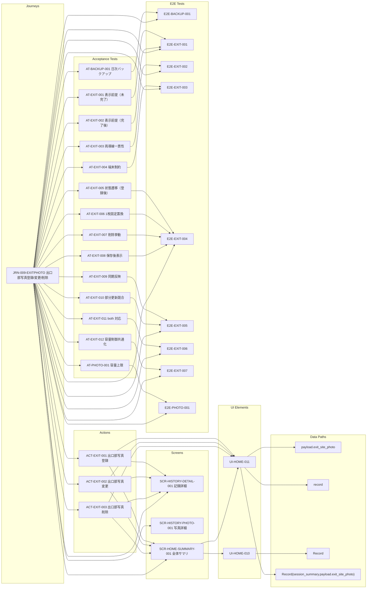

# SCR-HOME-SUMMARY-001 マップ

```mermaid
flowchart LR
  %% SCR-HOME-SUMMARY-001
  subgraph JRN["Journeys"]
    N31["JRN-009-EXITPHOTO 出口部写真登録/変更/削除"]
  end
  subgraph ACT["Actions"]
    N1["ACT-EXIT-001 出口部写真登録"]
    N2["ACT-EXIT-002 出口部写真変更"]
    N3["ACT-EXIT-003 出口部写真削除"]
  end
  subgraph SCR["Screens"]
    N32["SCR-HISTORY-DETAIL-001 記録詳細"]
    N33["SCR-HISTORY-PHOTO-001 写真詳細"]
    N34["SCR-HOME-SUMMARY-001 全体サマリ"]
  end
  subgraph UI["UI Elements"]
    N35["UI-HOME-010"]
    N36["UI-HOME-011"]
  end
  subgraph AT["Acceptance Tests"]
    N4["AT-BACKUP-001 日次バックアップ"]
    N5["AT-EXIT-001 表示前提（未完了）"]
    N6["AT-EXIT-002 表示前提（完了後）"]
    N7["AT-EXIT-003 両導線一貫性"]
    N8["AT-EXIT-004 端末制約"]
    N9["AT-EXIT-005 状態遷移（登録後）"]
    N10["AT-EXIT-006 1枚固定置換"]
    N11["AT-EXIT-007 削除挙動"]
    N12["AT-EXIT-008 保存後表示"]
    N13["AT-EXIT-009 同期反映"]
    N14["AT-EXIT-010 部分更新競合"]
    N15["AT-EXIT-011 both 対応"]
    N16["AT-EXIT-012 容量制御共通化"]
    N17["AT-PHOTO-001 容量上限"]
  end
  subgraph E2E["E2E Tests"]
    N22["E2E-BACKUP-001"]
    N23["E2E-EXIT-001"]
    N24["E2E-EXIT-002"]
    N25["E2E-EXIT-003"]
    N26["E2E-EXIT-004"]
    N27["E2E-EXIT-005"]
    N28["E2E-EXIT-006"]
    N29["E2E-EXIT-007"]
    N30["E2E-PHOTO-001"]
  end
  subgraph DATA["Data Paths"]
    N18["payload.exit_site_photo"]
    N19["record"]
    N20["Record"]
    N21["Record(session_summary.payload.exit_site_photo)"]
  end
  N1 --> N32
  N1 --> N34
  N1 --> N36
  N2 --> N32
  N2 --> N34
  N2 --> N36
  N3 --> N32
  N3 --> N34
  N3 --> N36
  N4 --> N22
  N5 --> N23
  N6 --> N23
  N7 --> N24
  N8 --> N25
  N9 --> N26
  N10 --> N26
  N11 --> N26
  N12 --> N26
  N13 --> N27
  N14 --> N27
  N15 --> N28
  N16 --> N29
  N17 --> N30
  N31 --> N1
  N31 --> N2
  N31 --> N3
  N31 --> N4
  N31 --> N5
  N31 --> N6
  N31 --> N7
  N31 --> N8
  N31 --> N9
  N31 --> N10
  N31 --> N11
  N31 --> N12
  N31 --> N13
  N31 --> N14
  N31 --> N15
  N31 --> N16
  N31 --> N17
  N31 --> N22
  N31 --> N23
  N31 --> N24
  N31 --> N25
  N31 --> N26
  N31 --> N27
  N31 --> N28
  N31 --> N29
  N31 --> N30
  N31 --> N32
  N31 --> N33
  N31 --> N34
  N34 --> N35
  N34 --> N36
  N35 --> N20
  N36 --> N18
  N36 --> N19
  N36 --> N21
```

