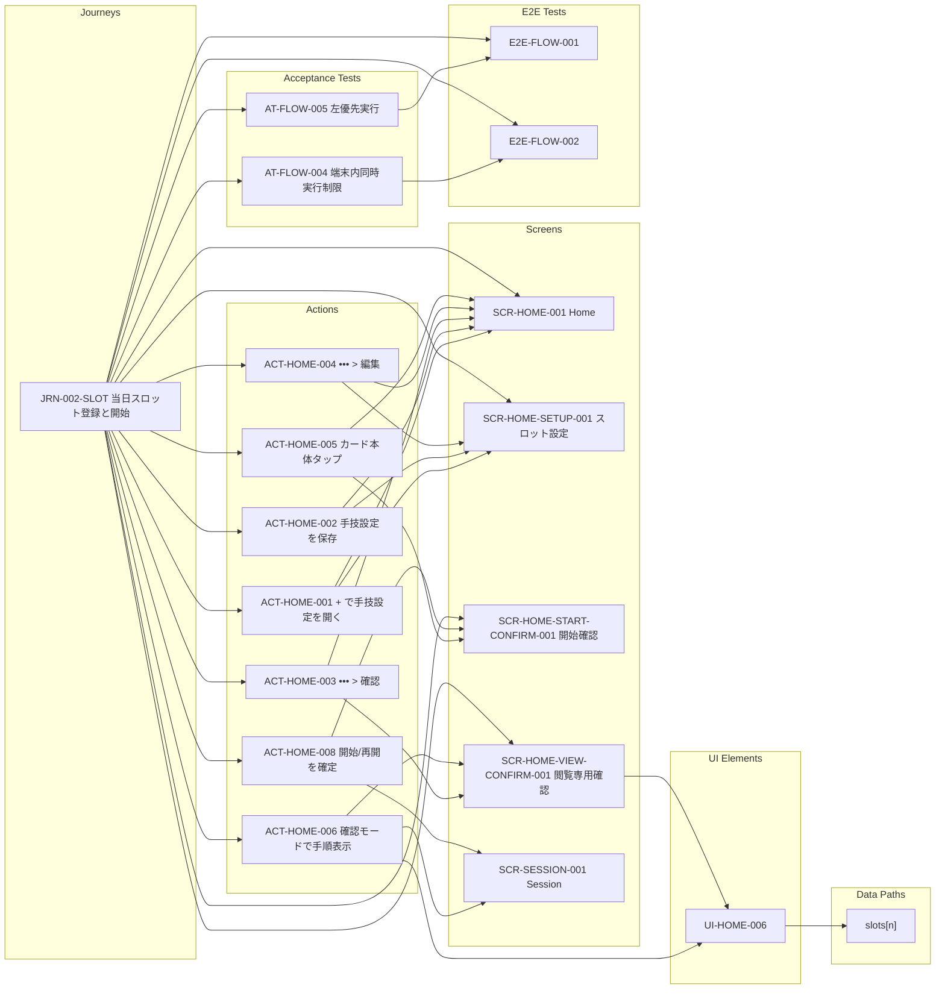

# SCR-HOME-VIEW-CONFIRM-001 マップ

```mermaid
flowchart LR
  %% SCR-HOME-VIEW-CONFIRM-001
  subgraph JRN["Journeys"]
    N13["JRN-002-SLOT 当日スロット登録と開始"]
  end
  subgraph ACT["Actions"]
    N1["ACT-HOME-001 + で手技設定を開く"]
    N2["ACT-HOME-002 手技設定を保存"]
    N3["ACT-HOME-003 ••• > 確認"]
    N4["ACT-HOME-004 ••• > 編集"]
    N5["ACT-HOME-005 カード本体タップ"]
    N6["ACT-HOME-006 確認モードで手順表示"]
    N7["ACT-HOME-008 開始/再開を確定"]
  end
  subgraph SCR["Screens"]
    N14["SCR-HOME-001 Home"]
    N15["SCR-HOME-SETUP-001 スロット設定"]
    N16["SCR-HOME-START-CONFIRM-001 開始確認"]
    N17["SCR-HOME-VIEW-CONFIRM-001 閲覧専用確認"]
    N18["SCR-SESSION-001 Session"]
  end
  subgraph UI["UI Elements"]
    N19["UI-HOME-006"]
  end
  subgraph AT["Acceptance Tests"]
    N8["AT-FLOW-004 端末内同時実行制限"]
    N9["AT-FLOW-005 左優先実行"]
  end
  subgraph E2E["E2E Tests"]
    N11["E2E-FLOW-001"]
    N12["E2E-FLOW-002"]
  end
  subgraph DATA["Data Paths"]
    N10["slots[n]"]
  end
  N1 --> N14
  N1 --> N15
  N2 --> N14
  N2 --> N15
  N3 --> N14
  N3 --> N17
  N4 --> N14
  N4 --> N15
  N5 --> N14
  N5 --> N16
  N6 --> N17
  N6 --> N18
  N6 --> N19
  N7 --> N16
  N7 --> N18
  N8 --> N12
  N9 --> N11
  N13 --> N1
  N13 --> N2
  N13 --> N3
  N13 --> N4
  N13 --> N5
  N13 --> N6
  N13 --> N7
  N13 --> N8
  N13 --> N9
  N13 --> N11
  N13 --> N12
  N13 --> N14
  N13 --> N15
  N13 --> N16
  N13 --> N17
  N17 --> N19
  N19 --> N10
```

