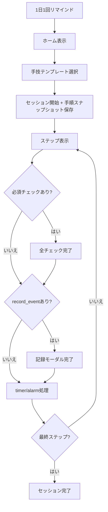

# 02. 運用フロー

## 1. 日次運用の基本
- ユーザーは1日1回の全体リマインドを受け取り、必要な手技を開始します。
- ホーム画面で手技テンプレートを選択し、1セッションを開始します。
- セッション開始時に、選択した手技の版スナップショットを保存します。

## 2. セッション実行フロー
1. ステップ表示（フェーズ/状態を常時表示）
2. 必須チェック項目があれば、全チェック完了まで遷移不可
3. `record_event` がある場合、記録モーダル完了まで遷移不可
4. `timer_event` があれば該当時刻を自動記録
5. `alarm_trigger=step_enter` があれば待機アラームを1回通知
6. `next_step_id` に従い次ステップへ遷移
7. 最終ステップ到達でセッション完了

## 3. 業務フロー図（共通）

## 4. フェーズ運用
v1ではフェーズを表示・把握用途に使い、遷移ロジックは `step_id -> next_step_id` の直列定義を唯一の正とします。

- 事前準備
- 接続
- 廃液
- 注液
- 切り離し
- 透析中
- 終了

## 5. 記録運用
- `drain_appearance`: 見た目分類 + 任意メモ + 任意写真
- `drain_weight_g`: 廃液重量（g）
- `bag_weight_g`: 透析液重量（g）
- `session_summary`: 血圧上/下、脈拍、体重、体温、尿量、排便回数、任意メモ

## 6. 異常判定運用（v1）
- 見た目分類ベースの簡易判定のみ。
- 異常分類時は警告表示します。
- 警告表示のみで、連絡導線は提供しません。

## 7. 運用上の品質チェック
CSV文言に以下が含まれる場合は運用品質警告として表示します。

- `xx` など時間未確定文言
- `(これはなんだろう)` など未確定文言
- ダミー電話番号表記（例: `03-xxxx-xxxx`）
