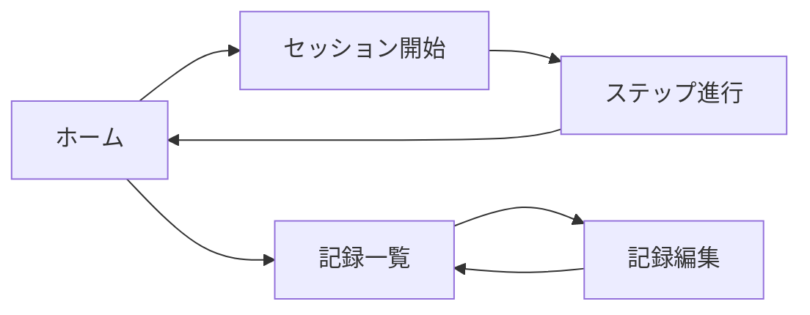

# 06. UIワイヤーフレーム（A案確定）

## 1. 目的
実装前にUI仕様を固定し、画面解釈のズレを抑えるためにホーム/セッションのA案を確定します。  
ホームは「手技開始ハブ + 当日CAPDノート表示」に限定し、過去記録は別画面へ分離します。

## 2. スパイク前提
- UI専用（ダミーデータ、API/DB更新なし）
- 実装コンポーネント基盤は `shadcn/ui`
- 対象はホームA/セッションA/記録一覧（構成確認）

## 3. 対象画面
- ホーム（手技テンプレート選択、当日ノート、記録一覧導線）
- 記録一覧（履歴表示/編集導線）
- セッション実行

## 4. 共通遷移


## 5. ホームA（確定）
```text
+------------------------------------------------+
| 02/10 (月)                                      |
+------------------------------------------------+
| [ + ] [ + ] [ + ] [ + ]                         |
+------------------------------------------------+
| #1 登録後                                  [•••]|
| レギニュール1.5                                  |
| ステータス：未実施 / 実施中 / 実施済み          |
| 推奨実施 20:00                                  |
| （カード本体タップで開始/再開ダイアログを表示）  |
+------------------------------------------------+
| 交換列 | #1 | #2 | #3 | #4 | #5                 |
| 貯留時間(timer:dwell start-end)                  |
| 透析液濃度(CSVタイトル: レギニュール1.5)         |
| 排液量(record:drain_weight_g)                    |
| 注液量(record:bag_weight_g)                      |
| 除水量(自動) / 排液時間(timer:drain start-end)   |
| 排液の確認(record:drain_appearance)              |
| 1日の総除水量(自動), 尿量, 飲水量, 体重, 排便,    |
| 血圧, 出口部状態, 備考                             |
+------------------------------------------------+
| [CSV取り込み(Mac)] [手動エクスポート]           |
| [記録一覧を開く]                                |
+------------------------------------------------+
```
- スロット登録時は、左から右へ推奨実施時間が厳密昇順（同時刻不可）になるように検証します。
- 右側スロットを開始するには、左側スロットがすべて `実施済み` である必要があります。
- `実施済み` スロットは編集/削除できません。対象日に進行中セッションがある間はスロット編集を行えません。
- `実施中` スロットは本体タップで進行中セッションを再開します（新規開始しません）。

### 5.1 ホームA 手技設定モーダル
```text
+-----------------------------------------------+
| #1 手技設定                                   |
| CSV選択: [レギニュール1.5 v]                  |
| 推奨実施時間: [20:00]                           |
|                          [キャンセル] [保存]   |
+-----------------------------------------------+
```

### 5.2 ホームA 手技開始確認モーダル
```text
+-----------------------------------------------+
| 手技の開始                                     |
| 手技: レギニュール1.5                          |
| ステータス：未実施 or 実施中                   |
| 推奨実施: 20:00                                |
|                        [閉じる] [開始/再開]    |
+-----------------------------------------------+
```

### 5.3 ホームA 手技内容確認モーダル（閲覧専用）
```text
+-----------------------------------------------+
| 手技内容の確認                                 |
| 手技: レギニュール1.5                          |
| ステータス：未実施                             |
| 推奨実施: 20:00                                |
| ※記録入力/タイマー設定/アラーム設定はなし      |
|                               [閉じる] [開始]  |
+-----------------------------------------------+
```

### 5.4 ホームA 右上メニュー（•••）
```text
+-----------------------------------------------+
| [確認]                                         |
| [編集]                                         |
+-----------------------------------------------+
```

## 6. 記録一覧（共通構成）
```text
+------------------------------------------------+
| 記録一覧                                         |
| 期間: [直近30日 v]  [検索]                      |
+------------------------------------------------+
| 日付 | 透析液濃度(#1-#5) | 貯留時間(#1-#5) | 排液量(#1-#5) |
| 注液量(#1-#5) | 排液時間(#1-#5) | 排液確認(#1-#5)        |
| 除水量(#1は未計算、#2以降は排液量-前回注液量)     |
| 総除水量(自動) | 尿量/飲水量 | 体重 | 血圧 | 写真リンク |
| 2026-02-09 | レギニュール1.5 | ... | ... | ... | ...    |
+------------------------------------------------+
| [ホームへ戻る]                                   |
+------------------------------------------------+
```

## 7. セッションA（レスポンシブ確定）

### 7.1 共通レイアウト規則
- 画像表示領域は常に 1:1 正方形
- iPhone: 1カラム（画像→手順→チェック/アラーム）
- Mac: 2カラム（左: 正方形画像、右: 手順/チェック/操作）

### 7.2 セッションA（安全フォーカス）
```text
+------------------------------------------------+
| フェーズ: 廃液 / 状態: お腹→廃液バッグ           |
+----------------------+-------------------------+
| [正方形画像]          | #21 タイトル/表示テキスト |
|                      | ! 警告帯(固定表示)       |
|                      | 必須チェック              |
|                      | ! 待機アラーム            |
|                      | [••• > セッションを中断（非常用）] |
|                      | [戻る] [次へ（条件未達で無効）] |
+----------------------+-------------------------+
```
- 次へ/戻る押下（またはEnterで次へ）時に、メインパネルは左右スライドで遷移します。
- カルーセルの左右ナビゲーションボタンは表示しません。
- 状態表示は `Compact Badge`（MynaUI icon + 色）で表示します。
- 「戻る」「次へ」は iPhone/Mac ともに横並び同幅で表示します。
- セッション中断は右上 `•••` からのみ実行し、確認ダイアログを挟みます。

## 8. UIプレビュールート
- `/ui-preview/home-a`
- `/ui-preview/history-list`
- `/ui-preview/session-a`
- `/ui-preview/status-patterns`

## 9. 採用基準（5段階）
- 安全性視認
- 次操作明確性
- 片手操作可読性
- 情報過不足
- 疲労感

## 10. 次の1修正ポイント
- UIスパイクの主要調整は完了。実装フェーズで実データ連携時の微調整のみ実施します。
