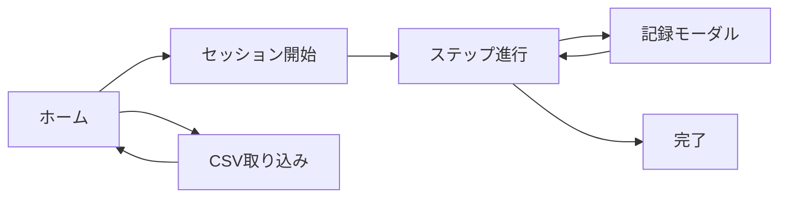

# 06. UIワイヤーフレーム（A/B）

## 1. 目的
実装前にレイアウト差分を固定し、画面解釈のズレを抑えるためにA/B 2案を定義します。  
`ui-spike-mockup` の方針に合わせ、差分対象を明確化した比較可能な形で整理します。

## 2. 対象画面
- ホーム（手技テンプレート選択）
- セッション実行
- 記録モーダル
- CSV取り込み
- セッション完了

## 3. 共通遷移


## 4. A案（安全フォーカス）

### 4.1 ホーム
```text
+------------------------------------------------+
| CAPD支援アプリ                                 |
| 1日1回リマインド: 20:00                        |
+------------------------------------------------+
| 手技テンプレート                                |
| [開始] ワンバッグ v3.0.0  有効: 2026-02-10     |
| [開始] 夜間排液 v1.2.0    有効: 2026-02-15     |
+------------------------------------------------+
| [CSV取り込み]                                   |
+------------------------------------------------+
```

### 4.2 セッション実行（1ステップ1画面）
```text
+------------------------------------------------+
| フェーズ: 廃液        状態: お腹→廃液バッグ      |
+------------------------------------------------+
| タイトル: お腹のチューブのクランプを開ける      |
| [画像]                                           |
| 表示テキスト                                     |
| ! 警告テキスト（高コントラスト帯）               |
+------------------------------------------------+
| 必須チェック                                     |
| [ ] クランプを開けた                              |
+------------------------------------------------+
| [次へ（無効）]  ※チェック完了後に有効化          |
+------------------------------------------------+
```

### 4.3 記録モーダル（全面）
```text
+------------------------------------------------+
| 記録: drain_appearance                          |
| 見た目: ( )透明 ( )やや混濁 ( )混濁 ( )血性 ... |
| 写真: [撮影/選択]（任意）                        |
| メモ: [..............................]（任意）   |
| [保存して次へ]                                   |
+------------------------------------------------+
```

## 5. B案（全体把握フォーカス）

### 5.1 ホーム
```text
+------------------------------------------------+
| CAPD支援アプリ  [今日の予定: 実施前]             |
+------------------------------------------------+
| テンプレート一覧                                |
| ワンバッグ v3.0.0         [選択]                |
| 夜間排液   v1.2.0         [選択]                |
+------------------------------------------------+
| [開始] [CSV取り込み]                             |
+------------------------------------------------+
```

### 5.2 セッション実行（進行見通し重視）
```text
+------------------------------------------------+
| フェーズ進行: 事前準備 > 接続 > 廃液 > ...       |
| 現在: 廃液 / お腹→廃液バッグ                     |
+------------------------------------------------+
| タイトル: お腹のチューブのクランプを開ける      |
| [画像]                                           |
| 表示テキスト / 警告テキスト                      |
+------------------------------------------------+
| 必須チェック [ ] クランプを開けた                |
| 次ステップ: 廃液中                               |
+------------------------------------------------+
| [保存] [次へ（ブロック条件あり）]                |
+------------------------------------------------+
```

### 5.3 記録モーダル（下部シート）
```text
+------------------------------------------------+
| 記録入力                                         |
| 必須項目を入力してください                        |
| ...                                               |
| [キャンセル] [保存]                               |
+------------------------------------------------+
```

## 6. 差分要約
- A: 安全動作を最優先し、1ステップ情報を大きく表示します。
- B: 先読み性を優先し、進行全体の見通しを強化します。
- 共通: 遷移ブロック条件（必須チェック、必須記録）は同一です。

## 7. 実装時のプレビュールート提案
UIスパイク実装時は以下ルートを推奨します。

- `/ui-preview/home-a`
- `/ui-preview/home-b`
- `/ui-preview/session-a`
- `/ui-preview/session-b`
- `/ui-preview/record-modal-a`
- `/ui-preview/record-modal-b`

## 8. 次の1修正ポイント
- セッション画面のA/Bで、警告テキスト帯の表示強度（色・余白・固定位置）を最初に比較確定します。
