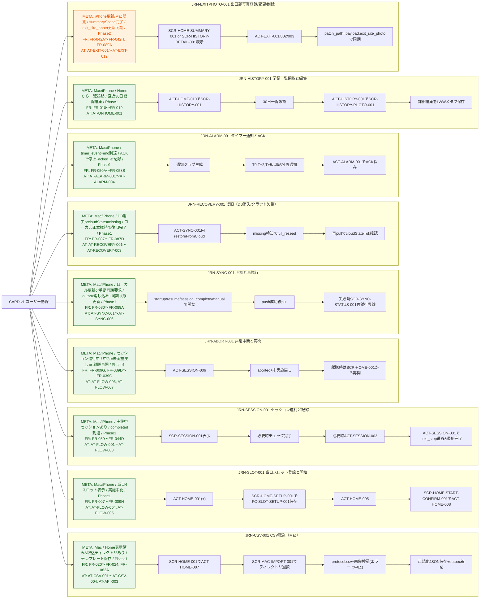

# 09. ユーザー動線定義（JRN）

## 1. 目的
本書は「誰が、どの端末で、どの順序で、何を完了させるか」を固定するための動線正本です。  
実装担当は `JRN-*` を起点に、`SCR-*` / `ACT-*` / `FC-*` / `AT-*` を逆引きして着手します。

## 2. ID規約
- 動線ID: `JRN-*`
- 画面ID: `SCR-*`（`10_screen_transition_and_actions.md`）
- 操作ID: `ACT-*`（`10_screen_transition_and_actions.md`）
- フォーム契約ID: `FC-*`（`11_form_contracts.md`）

## 3. 動線一覧（実装対象）
| JRN ID | 動線名 | 主端末 | 開始条件 | 完了条件 | 対応FR | 対応AT | Phase |
|---|---|---|---|---|---|---|---|
| JRN-CSV-001 | CSV取込（Mac） | Mac | Home表示済み、取込ディレクトリあり | テンプレート版が保存される | FR-020〜FR-024, FR-082A | AT-CSV-001〜AT-CSV-004, AT-API-003 | Phase1 |
| JRN-SLOT-001 | 当日スロット登録と開始 | Mac/iPhone | 当日4スロットが表示される | 対象スロットが `実施中` になる | FR-007〜FR-009H | AT-FLOW-004, AT-FLOW-005 | Phase1 |
| JRN-SESSION-001 | セッション進行と記録 | Mac/iPhone | 実施中セッションが存在する | 最終ステップ完了で `completed` になる | FR-030〜FR-044D | AT-FLOW-001〜AT-FLOW-003 | Phase1 |
| JRN-ABORT-001 | 非常中断と再開 | Mac/iPhone | セッション進行中 | 中断時は `未実施` に戻る、離脱時は再開できる | FR-009G, FR-039D〜FR-039G | AT-FLOW-006, AT-FLOW-007 | Phase1 |
| JRN-SYNC-001 | 同期と再試行 | Mac/iPhone | ローカル更新または手動同期要求あり | outboxが消し込まれ、同期状態が更新される | FR-080〜FR-089A | AT-SYNC-001〜AT-SYNC-006 | Phase1 |
| JRN-RECOVERY-001 | 復旧（DB消失/クラウド欠損） | Mac/iPhone | DB消失または `cloudState=missing` | ローカル正本を保持したまま復旧完了 | FR-087〜FR-087D | AT-RECOVERY-001〜AT-RECOVERY-003 | Phase1 |
| JRN-ALARM-001 | タイマー通知とACK | Mac/iPhone | `timer_event=end` 到達 | ACKで通知停止し `acked_at` 記録 | FR-050A〜FR-058B | AT-ALARM-001〜AT-ALARM-004 | Phase1 |
| JRN-HISTORY-001 | 記録一覧閲覧と編集 | Mac/iPhone | Homeから一覧へ遷移 | 直近30日記録を閲覧/編集できる | FR-010〜FR-019 | AT-UI-HOME-001 | Phase1 |
| JRN-EXITPHOTO-001 | 出口部写真登録/変更/削除 | iPhone（更新）/Mac（閲覧） | `summaryScope=both` または `first_of_day` 完了 | `payload.exit_site_photo` が更新され同期される | FR-042A〜FR-042H, FR-089A | AT-EXIT-001〜AT-EXIT-012 | Phase2 |

## 4. JRN詳細

### JRN-CSV-001 CSV取込（Mac）
1. `SCR-HOME-001` で `ACT-HOME-007`（CSV取り込み）を実行します。
2. `SCR-MAC-IMPORT-001` でディレクトリを選択します。
3. `protocol.csv` と画像群の検証を行い、エラーが1件でもあれば中止します。
4. 正規化JSONをローカルへ保存し outbox へ追記します。

### JRN-SLOT-001 当日スロット登録と開始
1. `SCR-HOME-001` で空スロットの `ACT-HOME-001`（`+`）を押します。
2. `SCR-HOME-SETUP-001` で `FC-SLOT-SETUP-001` を満たして保存します。
3. 登録済みカード本体の `ACT-HOME-005` で開始確認へ進みます。
4. `SCR-HOME-START-CONFIRM-001` で `ACT-HOME-008` を確定し `実施中` へ遷移します。

### JRN-SESSION-001 セッション進行と記録
1. `SCR-SESSION-001` で現在ステップを表示します。
2. 必須チェックがある場合は `ACT-SESSION-001` 実行前に完了します。
3. `record_event` がある場合は `ACT-SESSION-003` で記録保存します。
4. `ACT-SESSION-001` で `next_step_id` へ遷移し、最終ステップで完了処理を行います。

### JRN-ABORT-001 非常中断と再開
1. 中断時は `SCR-SESSION-001` の `ACT-SESSION-006` を実行します。
2. セッションは `aborted` で終了し、対応スロットを `未実施` に戻します。
3. 予期せぬ離脱時は `active` 維持のまま `SCR-HOME-001` から再開します。

### JRN-SYNC-001 同期と再試行
1. `startup/resume/session_complete/manual` の契機で同期を開始します。
2. `push` 成功後に `pull` を実行し差分適用します。
3. 失敗時は `SCR-SYNC-STATUS-001` に再試行導線を表示します。

### JRN-RECOVERY-001 復旧（DB消失/クラウド欠損）
1. `JRN-RECOVERY-001` では、DB消失時に `ACT-SYNC-001` の復旧処理として `restoreFromCloud` を実行します。
2. `pull` で `cloudState=missing` を検知した場合は `syncMode=full_reseed` を実行します。
3. 再シード後に再度 `pull` し `cloudState=ok` を確認して完了します。

### JRN-ALARM-001 タイマー通知とACK
1. `timer_event=end` かつ `timer_segment=dwell/drain` 到達で通知ジョブを生成します。
2. `T0`、`T+2分`、`T+5分以降3分` のルールで再通知します。
3. `ACT-ALARM-001` でACKした時点で通知停止し `acked_at` を保存します。

### JRN-HISTORY-001 記録一覧閲覧と編集
1. `SCR-HOME-001` から `ACT-HOME-010` で記録一覧へ遷移します。
2. `SCR-HISTORY-001` で30日範囲の一覧を確認します。
3. 写真リンクを押した場合は `ACT-HISTORY-001` で `SCR-HISTORY-PHOTO-001` を表示します。
4. 詳細表示で編集した項目はLWWメタ付きで保存します。

### JRN-EXITPHOTO-001 出口部写真登録/変更/削除（Phase2）
1. 対象 `session_summary` の完了後、`SCR-HOME-SUMMARY-001` または `SCR-HISTORY-DETAIL-001` に操作を表示します。
2. `ACT-EXIT-001/002/003` で登録・変更・削除します。
3. 保存は `patch_path=payload.exit_site_photo` の部分更新として同期します。

## 5. 完了判定
- 実装タスクは、着手前に対象 `JRN-*` を明示します。
- `JRN-*` ごとに `AT-*` のPassを完了条件とします。
- `JRN-*` 未接続の画面追加・機能追加は禁止します。

## 6. 動線可視化（Mermaid）
本図は `## 3` のメタ情報と `## 4` の手順を統合した参照図です。

