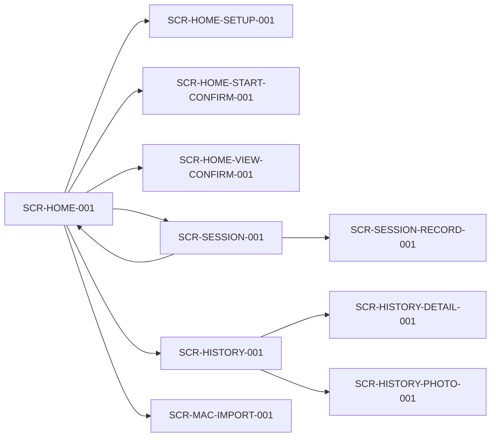

# Screens Index

## 1. 画面マップ（遷移図）

## 2. 画面一覧
| SCR ID | 目的 | 入口 | 出口 | 関連JRN | 個票 |
|---|---|---|---|---|---|
| SCR-HOME-001 | 手技開始ハブ | `/capd/home` | 各導線へ遷移 | JRN-001-CSV, JRN-002-SLOT, JRN-005-SYNC, JRN-008-HISTORY | [link](./SCR-001-HOME.md) |
| SCR-HOME-SETUP-001 | スロット設定 | Home内Dialog | Homeへ戻る | JRN-002-SLOT | [link](./SCR-002-HOME-SETUP.md) |
| SCR-HOME-START-CONFIRM-001 | 開始確認 | Home内Dialog | Sessionへ遷移 | JRN-002-SLOT | [link](./SCR-003-HOME-START-CONFIRM.md) |
| SCR-HOME-VIEW-CONFIRM-001 | 閲覧専用確認 | Home内Dialog | Session(確認モード) | JRN-002-SLOT | [link](./SCR-004-HOME-VIEW-CONFIRM.md) |
| SCR-HOME-SUMMARY-001 | 全体サマリ | Home内Section | 同画面維持 | JRN-009-EXITPHOTO | [link](./SCR-005-HOME-SUMMARY.md) |
| SCR-SESSION-001 | セッション進行 | `/capd/session` | Homeへ戻る | JRN-003-SESSION, JRN-004-ABORT, JRN-007-ALARM | [link](./SCR-006-SESSION.md) |
| SCR-SESSION-RECORD-001 | 記録入力 | Session内Dialog | Sessionへ戻る | JRN-003-SESSION | [link](./SCR-007-SESSION-RECORD.md) |
| SCR-HISTORY-001 | 記録一覧 | `/capd/history-list` | 詳細/写真へ遷移 | JRN-008-HISTORY | [link](./SCR-008-HISTORY.md) |
| SCR-HISTORY-DETAIL-001 | 記録詳細 | History内遷移 | Historyへ戻る | JRN-008-HISTORY, JRN-009-EXITPHOTO | [link](./SCR-009-HISTORY-DETAIL.md) |
| SCR-HISTORY-PHOTO-001 | 写真詳細 | History内遷移 | Historyへ戻る | JRN-008-HISTORY | [link](./SCR-010-HISTORY-PHOTO.md) |
| SCR-SYNC-STATUS-001 | 同期状態表示 | Header/バナー | 同画面維持 | JRN-005-SYNC, JRN-006-RECOVERY | [link](./SCR-011-SYNC-STATUS.md) |
| SCR-MAC-IMPORT-001 | CSV取込I/F | Home操作起点 | Homeへ戻る | JRN-001-CSV | [link](./SCR-012-MAC-IMPORT.md) |

## 3. 共通UIコンポーネント
- Modal/Dialog
- ErrorBanner
- LoadingSpinner
- ConfirmActionButton
