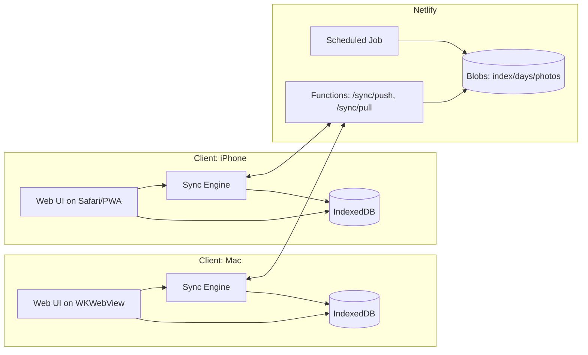

# Architecture Overview Contract

## 1. 目的
CAPD v1 を「Web本体 + Macネイティブシェル」で実装し、保存基盤を `IndexedDB（ローカル正本） + Netlify Blobs（共有/バックアップ）` に固定します。

## 2. システム構成

## 3. 設計原則
- セッション進行ロジックはクライアント共通で実装します。
- ローカル操作は常時可能にし、同期で最終整合を取ります。
- 競合はLWWを内部適用し、競合UIは持ちません。
- 同期とバックアップの境界を明確化し、クラウド欠損時は `full_reseed` で復旧します。

## 4. 主要構成要素
- UI: Next.js + shadcn/ui
- Local Domain: Session/Record/DailyPlan/Sync/Alarm Service
- Local Storage: IndexedDB
- Sync API: Netlify Functions
- Shared Storage: Netlify Blobs (`index.json`, `days/*.json`, `photos/*`)
- Backup: 日次ジョブ（30日保持）

## 5. 開始時スナップショット契約
- セッション開始時に `sessions` と `session_protocol_snapshots` を同一トランザクションで保存します。
- 再開時は開始時スナップショットのみを参照します。
- 欠落/ハッシュ不整合時は表示を停止し、復旧導線を表示します。

## 6. 参照リンク
- `./storage-model.md`
- `./api.md`
- `./state-machine.md`
- `../30_capabilities/CAP-SYNC-001.md`
- `../30_capabilities/CAP-RECOVERY-001.md`
- `../30_capabilities/CAP-SNAPSHOT-001.md`
